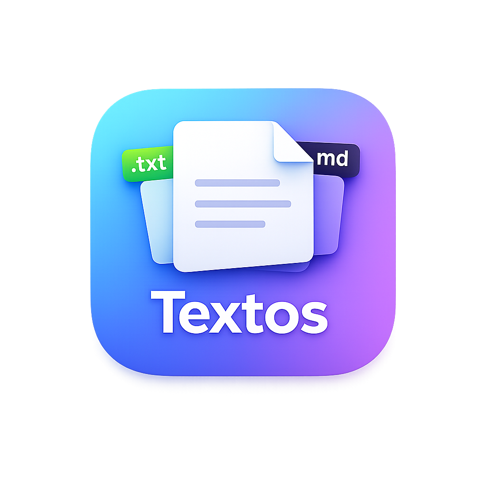

<div align="center">



# Textos

**글쓰기에만 집중할 수 있는, 미니멀 텍스트 에디터**

[](https://github.com/FocusKit/textos/releases/latest)
[](LICENSE)

</div>

---

## 특징

**깔끔한 편집 환경** — 군더더기 없는 인터페이스로 오직 글쓰기에만 몰입할 수 있습니다.

**일반 텍스트 & 마크다운** — `.txt`와 `.md` 두 가지 형식을 지원하며, 문서 특성에 맞는 최적의 편집 환경을 제공합니다.

**페이지 뷰** — A4 용지 위에 직접 쓰는 듯한 페이지 뷰 모드로, 인쇄 결과를 미리 가늠할 수 있습니다.

**마크다운 미리보기** — 마크다운 문서를 작성하면서 렌더링 결과를 바로 확인할 수 있습니다.

**나만의 설정** — 글꼴, 글꼴 크기, 자간, 줄간격, 텍스트 정렬, 테마를 자유롭게 조절하세요.

**라이트 & 다크 테마** — 시스템 설정을 따르거나 직접 선택할 수 있습니다.

## 시작하기

[Releases](https://github.com/FocusKit/textos/releases/latest) 페이지에서 최신 버전을 다운로드하세요.

|        플랫폼         |           파일           |
| :-------------------: | :----------------------: |
|   Windows (64-bit)    |  `Textos-x.x.x-x64.exe`  |
| macOS (Apple Silicon) | `Textos-x.x.x-arm64.dmg` |

## 개발

```bash
# 의존성 설치
npm install

# 개발 서버 실행
npm run dev

# 프로덕션 빌드
npm run build

# 릴리즈 패키징
npx electron-builder --win --x64
```

## 기술 스택

|            |                                    |
| ---------- | ---------------------------------- |
| 프레임워크 | Electron 40                        |
| UI         | React 19 · TypeScript              |
| 빌드       | electron-vite 5 · electron-builder |
| 마크다운   | react-markdown                     |

## 라이선스

[MIT License](LICENSE) &copy; 2026 송상윤
